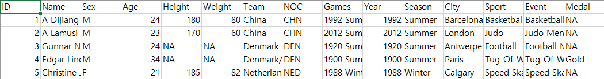
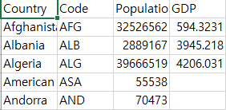
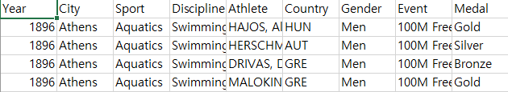
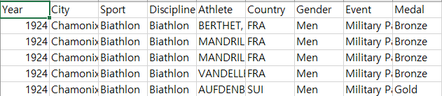
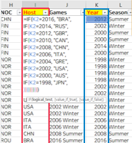
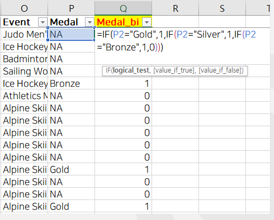
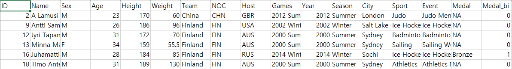
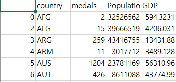

# 데이터분석 팀 프로젝트
## 프로젝트 출발점
 에이콘 아카데미 수강 때 진행한 데이터분석 팀 프로젝트입니다. 팀 단위 프로젝트였지만 미니 프로젝트라고 볼 수 있는 소규모의 작업이었습니다. 
분석 주제는 특별한 범주 없이 자유롭게 정할 수 있었고, 어떤 플랫폼으로 구성해도 상관이 없었습니다. 저희 팀의 경우엔, 모든 팀원이 데이터 분석은 처음 접했기 때문에 Web과 접목한다든지 다른 특별한 기술은 추가하지 않고 단순 데이터 분석만을 진행하기로 했습니다. 처음으로 다른 사람들과 함께 주제를 정하고 기획하며 머리를 맞대어 코드도 짜보면서, 팀 프로젝트의 재미를 느끼게 해준 소중한 경험이었기에 보잘 것 없지만 나름의 의미가 있는 작업물입니다. 
작고 사소한 우리 주변의 현상들 중, 프로젝트의 주체인 우리들부터 흥미를 갖고 접근할 수 있는 것을 다루면 재미있게 만들어볼 수 있겠다는 의견에서 출발하여 떠올린 것이 스포츠였습니다. 그러다 보니 자연스럽게 우리의 삶에서 스포츠를 가장 친숙하고 쉽게 접할 수 있는 매개체인 올림픽에 대한 분석거리를 생각해보게 되었습니다. '올림픽 성적과 관련이 있는 요소가 무엇이 있을까? 그것에 대해서 분석을 해보자'고 했고 최종적으로 3가지, '***개최국, 국가의 인구수, 국가의 1인당 국내총생산***'을 독립변수로 두고 분석을 해보기로 했습니다.


## 데이터 수집
 통계청이나 공공포털 등의 데이터가 가장 정확하긴 하겠지만 여러 국가의 데이터가 필요했습니다. 또한 비용을 들이지 않고 비교적 정돈된 데이터셋을 얻을 수 있는 'kaggle.com'에서 총 4개의 데이터셋을 수집했습니다. 
 [*120 years of Olympic history: athletes and results*](https://www.kaggle.com/datasets/heesoo37/120-years-of-olympic-history-athletes-and-results) -> athlete_events.csv 
 [*Olympic Sports and Medals, 1896-2014*](https://www.kaggle.com/datasets/the-guardian/olympic-games) -> dictionary.csv / summer.csv / winter.csv

## 데이터셋 변수  
**athlete_events.csv** -> 1896년부터 2016년까지 총 120년간의 올림픽 참가선수들과 성적 데이터  

*ID: 선수 식별번호  
*NOC: 국가 코드   
*Medal: 메달 획득 여부(메달 획득자는 메달 색으로, 그렇지 않은 사람은 NA 값 부여)
___


**dictionary.csv** -> 국가별 인구수와 1인당 국내총생산(GDP per capita) 데이터   

특정 시점 혹은 기간에 대한 설명이 없어서 정확히 수치가 일치하는 자료가 있는지 찾아보았는데, 딱 하나의 데이터셋을 찾을 수 있었습니다. 2015년의 데이터라고 나와있었지만 공공 포털의 데이터가 아니었고 이 역시 Github에 올려둔 개인의 데이터셋이었기 때문에 완벽히 신뢰할 수는 없었습니다. 
데이터의 마지막 업데이트 시점 고려, 다른 자료들의 수치와 비교 -> 대략 2013부터 2017년 사이의 데이터라고 잠정했습니다.   
**(GDP 칼럼은 *1인당 국내총생산인 'GDP per capita*'를 의미. / 단위: 달러)**  
___
**summer.csv** -> 1896년부터 2014년까지의 모든 하계올림픽 메달 수여자의 데이터  

___
**winter.csv** -> 1896년부터 2014년까지의 모든 동계올림픽 메달 수여자의 데이터  
  

## 데이터 전처리  
**athlete_events.csv**  
   1. 120년간의 데이터 양이 너무 방대하여, 팀원 분께서 엑셀 작업으로 1998년 전의 데이터는 모두 제거. 1998-2016 데이터만 사용.  
   2. 개최국을 나타낼 범주형 변수인 'Host' 칼럼을 새로 만들고 '국가코드(NOC)' 칼럼의 표기 방법을 똑같이 따름.  
   
   3. 메달 색에 관계 없이 메달 획득 여부만을 확인할 수 있는 범주형 변수인 'Medal_bi' 칼럼을 추가.
     
   4. 위 과정을 거쳐 새로 만든 데이터셋 -> *'recent10Olympics_hostCntry.csv'*  
   
___
**dictionary.csv / summer.csv / winter.csv**  
   1. Python의 pandas 라이브러리 이용.  
   2. summer.csv와 winter.csv를 먼저 병합하고, 국가별로 누적 메달 수를 집계한 새로운 데이터프레임 생성.  
   3. 이 데이터를 dictionary.csv와 병합하고, 필요 없는 칼럼 및 결측치를 제거하여 새로운 csv 파일로 저장. -> *'Olympics_GDP_Pop.csv'*  

```python
import pandas as pd

# 데이터 읽기 및 확인
summer_data = pd.read_csv("summer.csv")
winter_data = pd.read_csv("winter.csv")
dic_data = pd.read_csv("dictionary.csv")

# 데이터 병합 
frame = [summer_data, winter_data]
data = pd.concat(frame)
# print(data.columns)
# print(data)

series = data.groupby(['Country']).Medal.count()  # 국가별 총 누적 메달 수 추출 
df = pd.DataFrame({'country':series.index, 'medals':series.values})
# print(df)
# print(type(df))

print()
final_df = pd.merge(df, dic_data, left_on='country', right_on='Code').drop(['Code', 'Country'], axis=1)

# 결측 값 제거
final_df = final_df.dropna(how='any')
print(final_df)

# .csv로 저장
final_df.to_csv('Olympics_GDP_Pop.csv', sep=',')
```



해당 데이터 전처리 작업 모듈도 프로젝트 폴더에 포함되어 있습니다. -> *'dataPreproc.py'*  

## 세부 분석 방법 및 단위  
1. 개최국 여부가 메달 성적과 관련이 있는가? 
   - 이원카이제곱 검정(변수 2개 / 독립변수: 범주형 / 종속변수: 범주형) 
   - *recent10Olympics_hostCntry.csv* 사용
2. 국가의 1인당 국내총생산이 메달 성적과 관련이 있는가?
   - 단순 회귀분석(1개의 독립변수 / 독립변수: 연속형 / 종속변수: 연속형)
   - *'Olympics_GDP_Pop.csv'* 사용
3. 국가의 1인당 국내총생산과 인구수는 메달 성적과 관련이 있는가?
   - 다중 회귀분석(복수의 독립변수 / 독립변수: 연속형 / 종속변수: 연속형)
   - *'Olympics_GDP_Pop.csv'* 사용

## 기술 스택 및 환경  
Python v3.8.8(Anaconda package v4.10.1)  
Python 내의 데이터분석 관련 라이브러리(numpy / pandas / matplotlib / statsmodels / scipy /seaborn 등)  

## 보완점 및 리뷰  
개최국과 메달 성적의 연관성 분석  
 - 카이제곱 검정은 시각화 구현이 불가한 점은 아쉽다.  
 - 카이제곱 검정은 독립변수, 종속변수 사이의 **연관성**이 있다고 판단할 수 있으나, 두 변수 사이의 직접적인 **인과성**을 나타낼 수는 없다.  
 - '개최국 여부 - 메달 성적' 분석에서, 메달 획득 여부에 따라 2가지 값 중 하나가 매겨지는 범주형 변수로 나누게 됨. 연속형으로 놓고 T-test검정을 했으면 조금 더 정교한 분석이 되지 않았을까 싶다.
 -  두 회귀분석 모두 누적 메달 수를 통해 예측을 한 것이기 때문에 단일 대회에서의 성적 예상과 같은 실용적인 분석이 되지는 못한 것 같다. 
 - 다중 회귀분석의 시각화를 구현하지 못한 것 역시 아쉬운 점으로 남았다.
 - 파이썬의 데이터분석 라이브러리들이 정보를 찾아보면 비교적 코드는 빠르게 이해할 수 있지만, 아직은 익숙지 못해서 직접 코드를 짜고 구현하는 데에는 더 일조하지 못한 것 같다. 

